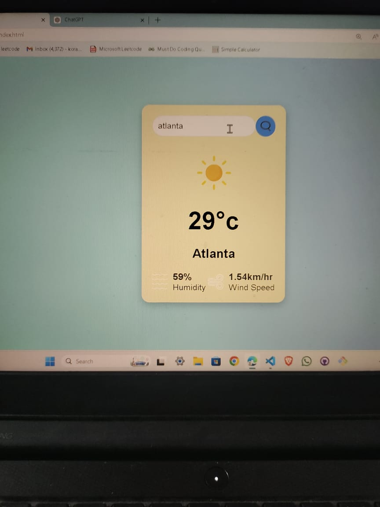
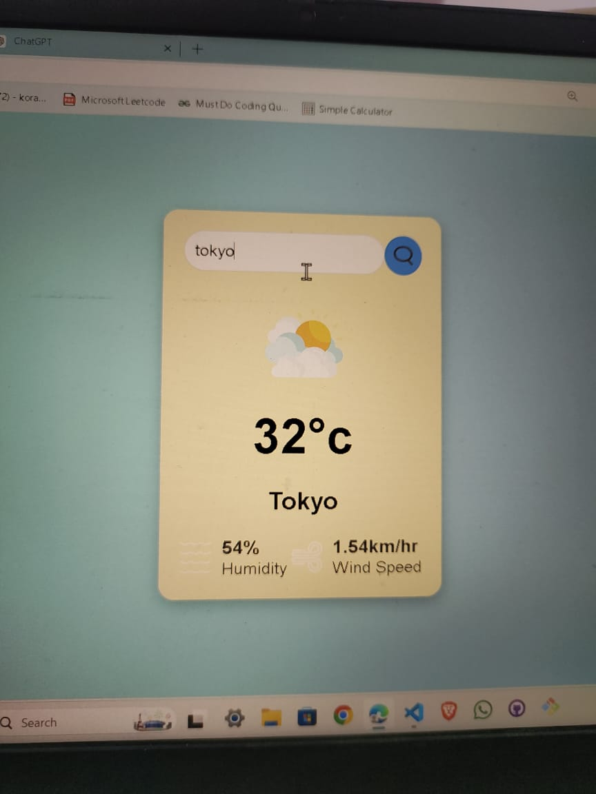

# Weather App

A simple weather application that allows users to check the current weather conditions in any city. This project utilizes the OpenWeatherMap API to fetch weather data, including temperature, humidity, and wind speed.

## Features

- Search for weather information by city name.
- Display current temperature, humidity, and wind speed.
- User-friendly interface with clean design.
- Responsive layout for various screen sizes.

## Technologies Used

- HTML
- CSS
- JavaScript
- [OpenWeatherMap API](https://openweathermap.org/api)






## Setup and Installation

Follow these steps to set up and run the project on your local machine:

## Setup and Installation

Follow these steps to set up and run the project on your local machine:

```bash
1. **Clone the Repository**
   git clone https://github.com/your-username/weather-app.git
   cd weather-app

2. **Obtain an API Key**
   - Sign up at [OpenWeatherMap](https://openweathermap.org/) and get your free API key.

3. **Add Your API Key**
   - Replace the placeholder API key in `script.js` with your actual API key.
   const apiKey = "your_api_key_here";

4. **Run the Project**
   - Open the `index.html` file in your browser to view the app.

